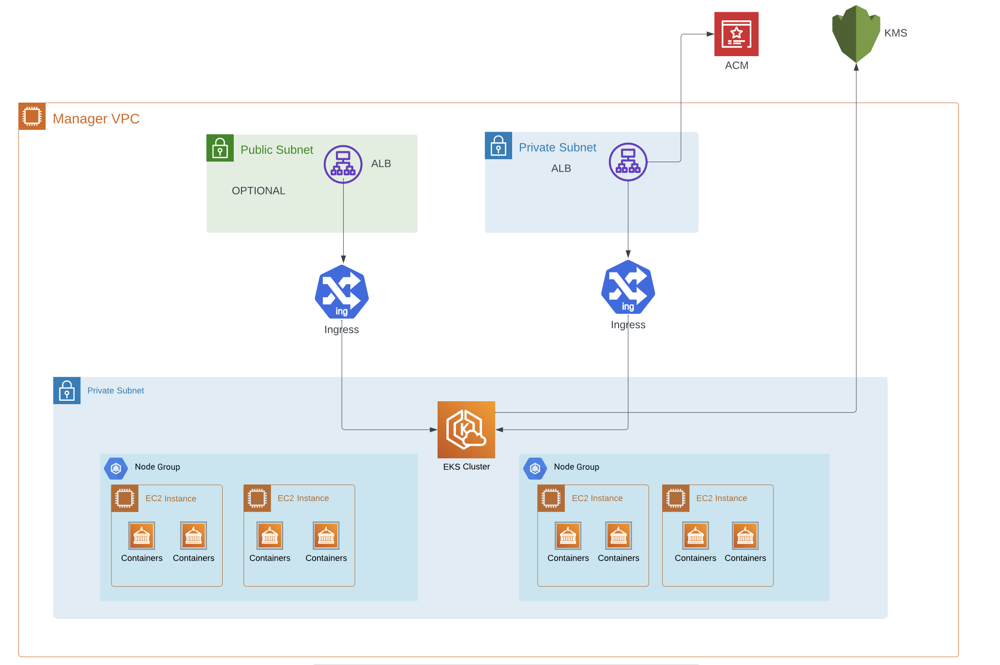
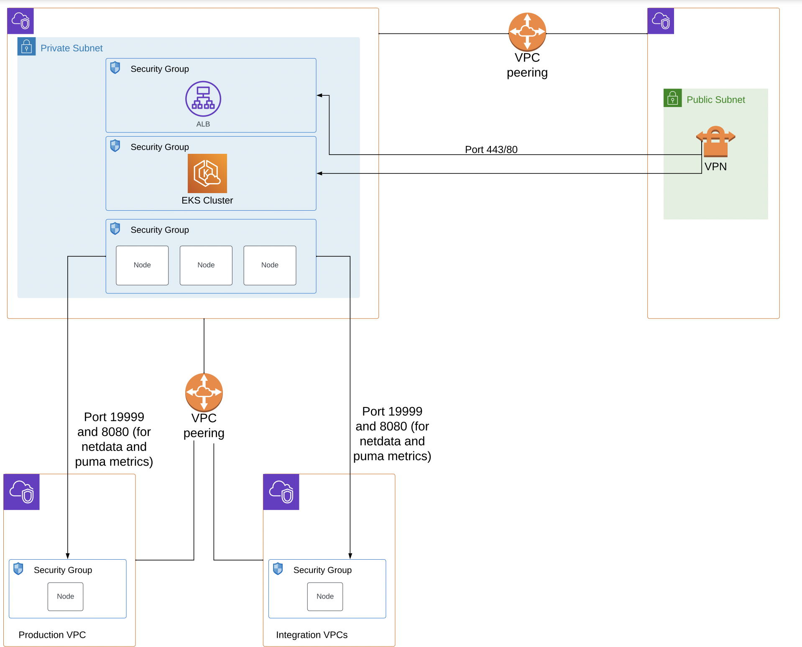
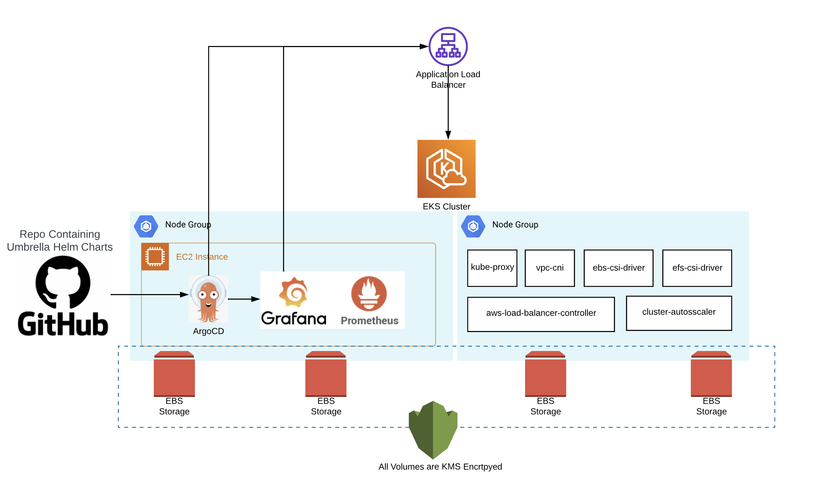
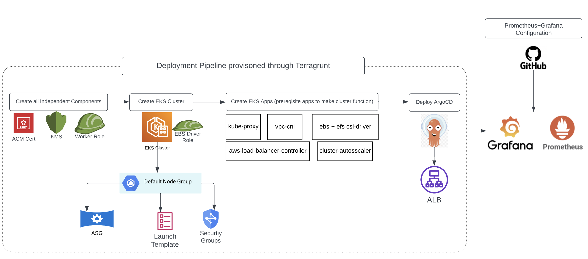

# EKS Infra
This terraform code creates a customised EKS infra with VPC prerequisites and some applications on top of infra like argocd.
It has some custom created modules but specifically for eks we take help from [eks-blueprints](https://github.com/aws-ia/terraform-aws-eks-blueprints/tree/v4.32.1) provide by aws community.


## Directory Structure
```
.
├── README.md
├── docs  # contains the dpc files and deployment steps
├── infra_resources      # contains the actual resources
│   ├── acm
│   │   └── terragrunt.hcl
│   ├── argocd
│   │   └── terragrunt.hcl
│   ├── backend.tf
│   ├── ebs-csi-driver-role
│   │   ├── templates
│   │   │   └── ebs-csi-driver-managed-policy.tpl
│   │   └── terragrunt.hcl
│   ├── eks
│   │   └── terragrunt.hcl
│   ├── eks-worker-node-role
│   │   └── terragrunt.hcl
│   ├── global.hcl
│   ├── internal_alb_security_group
│   │   └── terragrunt.hcl
│   ├── kms
│   │   └── terragrunt.hcl
│   ├── kubernetes
│   │   ├── aws-load-balancer-controller
│   │   │   └── terragrunt.hcl
│   │   ├── cluster-autoscaler
│   │   │   └── terragrunt.hcl
│   │   ├── ebs_csi_driver
│   │   │   └── terragrunt.hcl
│   │   ├── efs-csi-driver
│   │   │   ├── terragrunt.hcl
│   │   │   └── values.yaml
│   │   ├── kube-proxy
│   │   │   └── terragrunt.hcl
│   │   └── vpc-cni
│   │       └── terragrunt.hcl
│   ├── nodegroups
│   │   └── devops
│   │       └── terragrunt.hcl
│   ├── terragrunt.hcl
│   └── vpc
│       └── terragrunt.hcl
└── modules # contains the terraform modules
    ├── aws
    │   ├── acm
    │   ├── efs
    │   ├── iam
    │   │   ├── README.md
    │   │   ├── iam-role
    │   │   └── iam-user
    │   ├── kms
    │   ├── security_group
    │   └── vpc
    │       ├── README.md
    │       ├── main.tf
    │       ├── modules
    │       │   └── terraform-aws-vpc
    │       │       └── vpc-flow-logs.tf
    └── kubernetes
        ├── argocd
        ├── aws-load-balancer-controller
        ├── cluster-autoscaler
        ├── ebs-csi-driver
        ├── efs-csi-driver
        ├── kube-proxy
        └── vpc-cni
```


## Backend
Code uses S3 backend whose config can be found in `infra_resources/terragrunt.hcl` file

## **Network Architecture**



### **Private Subnets and Manager VPC**

EKS cluster will be deployed within a dedicated VPC - `eks-cluster` VPC. This choice is made to ensure a controlled environment for the EKS cluster.



- EKS cluster's worker nodes, control plane, and supporting infrastructure will be hosted within private subnets of the `eks-cluster` VPC. Private subnets enhance security by limiting direct public access to the resources.
- EKS API server and ALB hosted inside EKS have their own dedicated Security group, so that access can be controlled through IPs like in case of a VPN

In future, if we want to enable any publicly accessible application within our cluster, we can create an Internet facing ALB in public subnet and route ingress traffic to it. 

### **ALB Configuration and Listener Rules**

To facilitate external access to workloads, an ALB will be set up. The ALB will be placed in a private subnet to maintain a secure architecture. HTTPS traffic will be secured using an ACM (AWS Certificate Manager) certificate.

The ALB will have listener rules configured based on the Ingress resources. These rules can be *host-based* or *path-based*, enabling effective routing of incoming requests to the appropriate backend services.

## **EKS Overview**



### **Node Groups and Workload Organisation**

The EKS cluster's workloads will be organised using **Node Groups**. A Node Group is a collection of worker nodes with similar configurations and characteristics. It allows for better resource allocation and isolation of workloads. 

**Example of Workload Separation**

Imagine you have two distinct applications: an “e-commerce storefront” and a “backend data processing” system. To ensure resource isolation and performance optimization, you could create separate Node Groups for these applications.

1. **E-Commerce Storefront Node Group**: This Node Group could be configured with specific resources and tolerations optimized for handling web traffic. It might have more CPU and memory resources allocated to accommodate user requests efficiently.
2. **Backend Data Processing Node Group**: The Node Group for the backend processing system might be tuned differently, with a focus on CPU-intensive tasks. It could have different instance types or resource allocations to meet the demands of data processing workloads.

To illustrate, let's delve into an example where a Node Group named "default" is employed to host critical system-level EKS applications.

**The "default" Node Group**

The `default` Node Group is designated to handle essential EKS system applications. These applications provide fundamental functionalities required for the cluster's operation, management, and networking.

1. **Kube-proxy**: Kube-proxy is a network proxy that maintains network rules and enables communication between services within the cluster. It ensures that requests are properly routed to the appropriate pods, facilitating seamless inter-pod communication.
2. **VPC CNI (Amazon VPC Container Network Interface)**: VPC CNI enables pods to communicate over Amazon VPC networking. It establishes network connectivity between pods and is crucial for facilitating secure and efficient communication within the cluster.
3. **EBS CSI Driver (Amazon Elastic Block Store Container Storage Interface Driver)**: The EBS CSI driver allows pods to use Amazon EBS volumes as persistent storage. This driver facilitates dynamic provisioning of EBS volumes, ensuring reliable and scalable storage solutions for applications.
4. **EFS CSI Driver (Amazon Elastic File System Container Storage Interface Driver)**: The EFS CSI driver enables pods to utilize Amazon EFS as a shared file system. It's suitable for scenarios where multiple pods need to share data or state.
5. **AWS Load Balancer Controller**: This application manages the creation and configuration of AWS Load Balancers. It automatically discovers services exposed through Kubernetes Services of type LoadBalancer and configures the corresponding AWS resources.
6. **Cluster Autoscaler**: The Cluster Autoscaler adjusts the number of worker nodes in the cluster based on the current resource demands. It helps ensure that the cluster efficiently utilizes resources while automatically scaling up or down to meet workload requirements

### **Encryption and Security with KMS**

To enhance security, the EKS cluster will be associated with a KMS key. This KMS key will be used to 

- encrypt sensitive data, including secrets, and
- EBS Volumes attached to servers in the cluster

## **Deployment Pipeline**



[Deployment Instructions](docs/README.md)


### **Infrastructure as Code with Terragrunt**

The entire infrastructure for the EKS cluster will be defined and provisioned using Terragrunt, a wrapper around Terraform. Terragrunt helps maintain clean and organized Terraform code, handle dependencies, and manage configurations across different environments.

### **IAM Roles and Kubernetes Resources**

The deployment pipeline will also create IAM roles for Service Accounts (IRSA) within Kubernetes. These roles will grant specific permissions to pods, allowing them to interact with other AWS services securely.

Various Kubernetes resources, such as *Deployments, Services, and ConfigMaps*, will be managed through the deployment pipeline. These resources are essential for setting up the required infrastructure for the monitoring stack.

## **Workload Deployment**

### **Ingress Load Balancer for Browser Access**

Outbound access to workloads that require browser access, such as `ArgoCD` and `Grafana`, will be provided through the Ingress ALB. This ALB will be placed in a private subnet, allowing only VPN access.

### **ArgoCD for GitOps**

Workload deployment and management will follow the GitOps approach using `ArgoCD`. 

ArgoCD will be connected to a GitHub repository hosting Helm charts for Kubernetes applications. This simplifies the process of deploying and updating workloads while ensuring version control and consistency.

### **Prometheus and Grafana Deployment**

The monitoring stack consisting of `Prometheus` and `Grafana` will be deployed using the `kube-prometheus-stack` Helm chart. Grafana's High Availability (HA) will be supported by this chart, while Prometheus's HA can be integrated using the `Thanos` Helm sub chart.